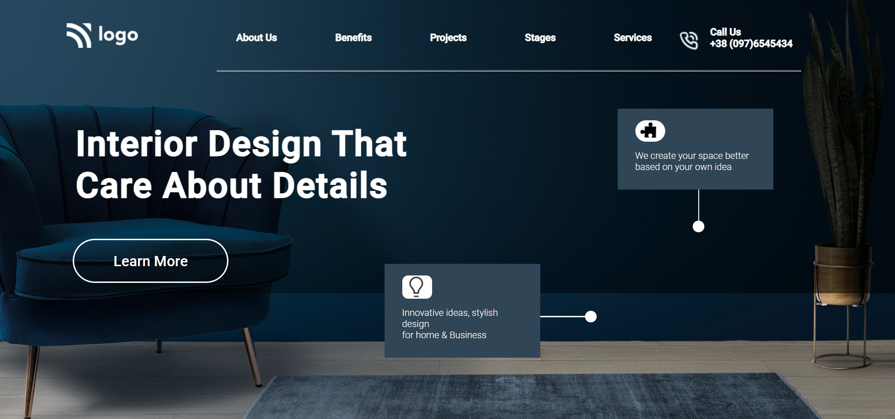

# Live-Project-10-Interior-Design-Landing-Page

## Project 10: [Live Link](https://live-projecct-10-fs-js.netlify.app/)

-   Skills Gained in this project.
    - Learned to use image opacity with linear gradient to give a dimmed effect, how to use translucent backgrounds on elements stacked with images and to make front elements maximize their visibility.   
    
---

## Time taken to finish this project⏲

- >Around 3.5 hours.

#### Screenshot

